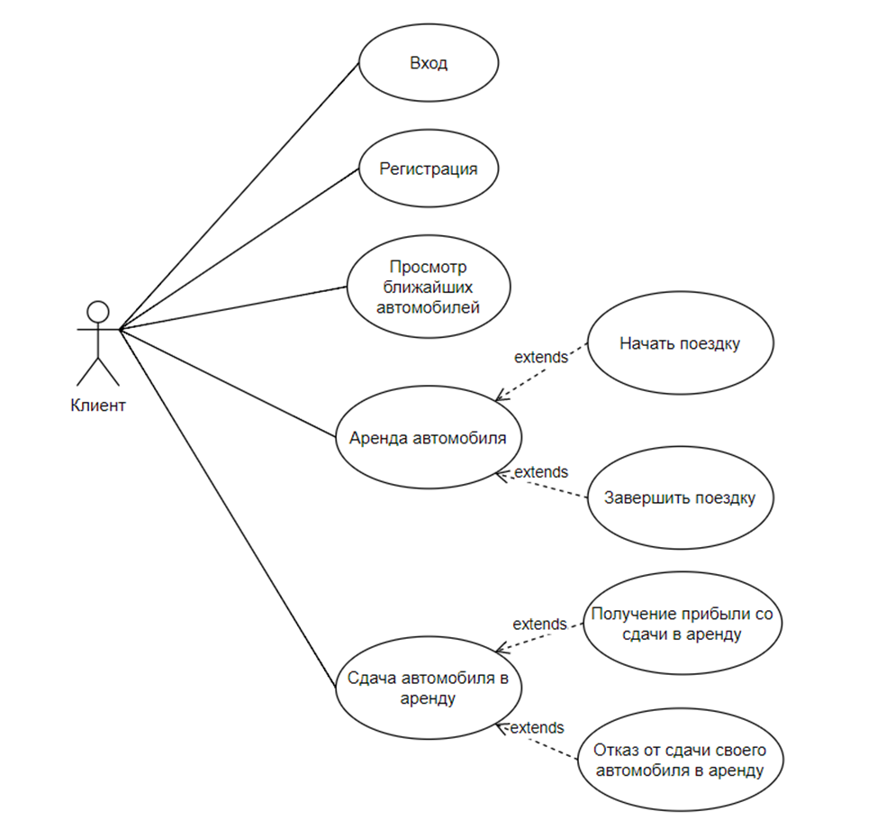
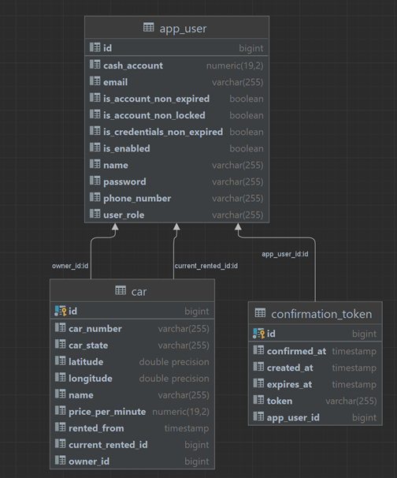

# Приложение "Каршеринг"

Приложение предоставляет следующие возможности:
•	Просмотр ближайших к клиенту автомобилей на основе его географического положения,
•	Возможность взять автомобиль в аренду,
•	Возможность завершить поездку,
•	Возможность оплатить поездку (будет использоваться ненастоящая валюта в связи со сложностью интеграции с настоящими системами оплаты),
•	Возможность сдать свой автомобиль в аренду,
•	Возможность получать прибыль с аренды автомобиля,
•	Авторизация и аутентификация.

Для наглядной демонстрации функций и клиентов системы изобразим диаграмму прецедентов системы.

диаграмма прецедентов

---

В приложении можно выделить следующие логические модули:
•	UI модуль, обеспечивающий связку пользовательского интерфейса и сервиса
•	Модуль регистрации, авторизации и аутентификации
•	Модуль работы с автомобилями,
•	Модуль работы с пользователями,
•	Модуль почтовой рассылки.

Приложение имеет архитектуру модульного монолита и использует для хранения данных реляционную СУБД Postgres. Приложение использует сервер Tomcat, обернутый в Spring Web MVC. Для работы с базой данных в приложении используется Spring Data JPA, который является более удобным адаптером к Hibernate.

Для реализации пользовательского интерфейса был использован популярный шаблонизатор Thymeleaf, с помощью которого можно быстро разработать пользовательский интерфейс с соблюдением прицнипа DRY (don’t repeat yourself).

Кроме того, мной были использованы Docker и Docker compose, что делает приложение платформо-независимым, и позволяет удобно разворачивать его в облаке.

Также в процессе разработки мной была использована библиотека Lombok, генерирующая однотипный код, Jakarta Mail API для отправки сообщений о регистрации пользователей, Spring Security для реализации авторизации и аутентификации пользователей приложения.

В данном приложении можно выделить сущности, изображенные на рисунке:
